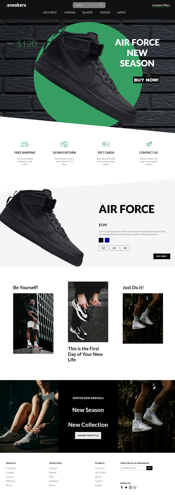

# Sneakers Shoes Online Shopping Landing Page

# Octanet Services Pvt Ltd Summer Internship 2024

Welcome to the repository for my summer internship tasks at Octanet Services Pvt Ltd in 2024.

## Task-1: Sneakers Shoes Landing Page

For my first task, I created a Sneakers Shoes Landing Page using HTML, CSS, and a small portion of JavaScript. This landing page is designed to showcase a variety of sneakers and provide an engaging user experience. Here's a brief overview of what I implemented:

- **HTML Structure**:
  - Organized the layout using semantic HTML elements.
  - Included sections for featured sneakers, product categories, and a contact form.
  
- **CSS Styling**:
  - Applied CSS styles for layout, typography, colors, and animations.
  - Utilized CSS Grid and Flexbox for responsive design.
  - Ensured the page is visually appealing and user-friendly.

- **JavaScript Functionality**:
  - Implemented interactive features such as image sliders and dropdown menus using JavaScript.
  - Added form validation to ensure data integrity when submitting the contact form.

### How to Access the Sneakers Shoes Landing Page

To view the Sneakers Shoes Landing Page, simply open the `index.html` file in your web browser. You can also deploy it to a web server for online access.

### Repository Structure

├── index.html # Main HTML file for the landing page 
├── styles.css/ # Directory for CSS stylesheets 
├── script.js/ # JavaScript code for interactive functionality 
└── images/ # Directory for images used in the landing page 

Feel free to explore the code and make any suggestions for improvements or enhancements. Your feedback is greatly appreciated!