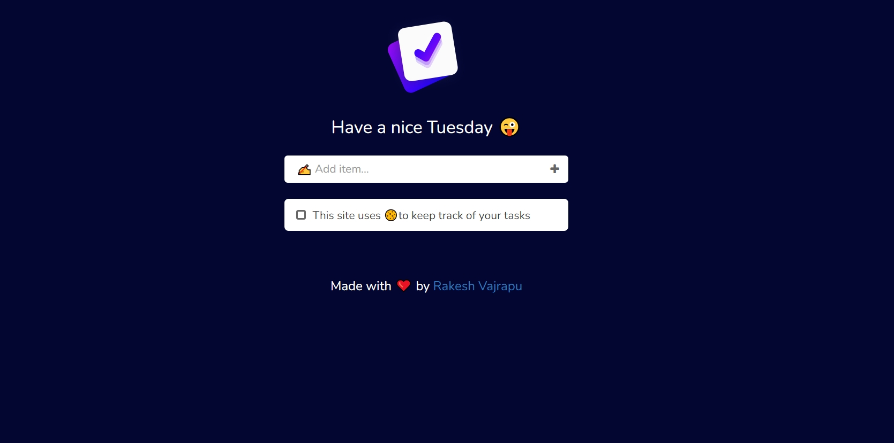

# Octanet Services Pvt Ltd Summer Internship 2024

Welcome to the repository for my summer internship tasks at Octanet Services Pvt Ltd in 2024.

## Task-2: To Do List Website

This is a simple To Do List website built using HTML, CSS, and JavaScript. It provides a user-friendly interface for managing tasks efficiently, allowing users to add, update, and delete tasks easily.

### How to Access the To Do List Website

To view the To Do List Website, simply open the `index.html` file in your web browser. You can also deploy it to a web server for online access.

### Repository Structure

├── index.html # Main HTML file for the landing page 
├── styles.css/ # Directory for CSS stylesheets 
├── script.js/ # JavaScript code for interactive functionality 
└── images/ # Directory for images used in the To Do List Website 

Feel free to explore the code and make any suggestions for improvements or enhancements. Your feedback is greatly appreciated!